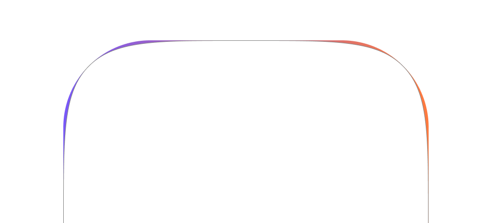
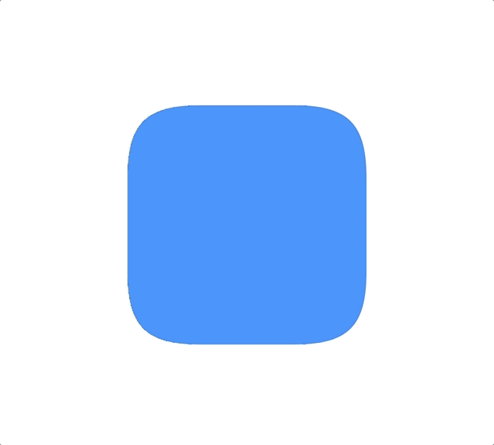

<p align="center">
  
</p>

<h3 align="center">Squircles for web</h3>

<p align="center">
  <a href="https://www.npmjs.com/package/squircle.js">
    
  </a>
</p>

## What is squircle?

A squircle is a shape intermediate between a square and a circle. There are at least two definitions of "squircle" in use, the most common of which is based on the superellipse. The word "squircle" is a portmanteau of the words "square" and "circle". Squircles have been applied in design and optics. — [Wikipedia](https://en.wikipedia.org/wiki/Squircle)

<p align="center">
  
</p>

## Why squircle.js?

In CSS, currently there is no such a spec for making squircles yet, and apparently it's not possible with just `border-radius`. The most common solution to implement squircles in web is to mask elements with a squircle image or an SVG path like this [page](https://apps.apple.com/kr/app/%EB%B0%B0%EB%8B%AC%EC%9D%98%EB%AF%BC%EC%A1%B1/id378084485). Unfortunately these static masks are unchangeable and doesn't work responsively. Every time you have to manually create an image or generate one using some [tools](https://squircley.app).

**squircle.js** automatically and dynamically generates squircle SVG path based on the element's size and its border radius.

<p align="center">
  
</p>

## Installation

```zsh
npm i squircle.js
```

## API

```ts
import { squirclify } from 'squircle.js'

const toBeSquircles = document.querySelectorAll('.squircle')

squirclify(Array.from(toBeSquircles))
```

## Limitations

- It uses `SVGElement`. [Checkout browser compatibility](https://caniuse.com/?search=svg).
- It uses CSS `clip-path`. [Checkout browser compatibility](https://caniuse.com/?search=clip-path).
- Don't apply squircle to an element that resizes too many times.

## To Do

- [ ] Demo website
- [ ] React
- [ ] Vue
- [ ] Svelte
- [ ] Garbage collect unused masks
- [ ] Unobserve removed DOMs

## License

MIT
